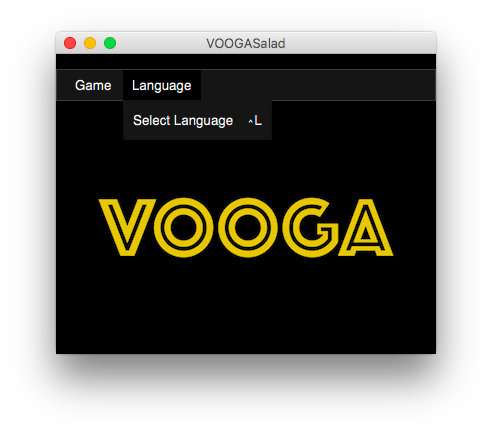
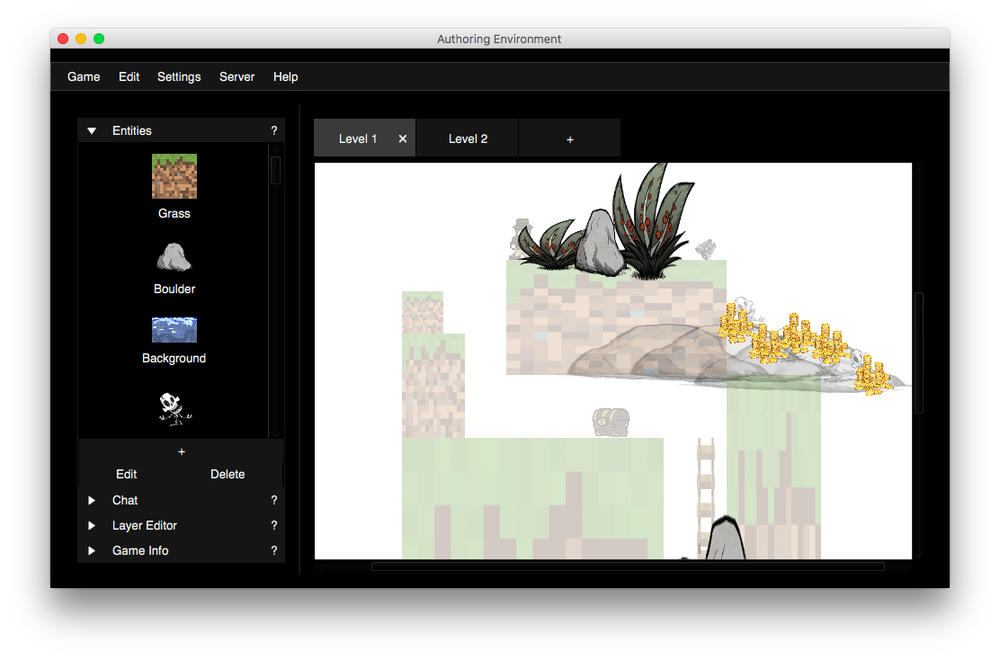
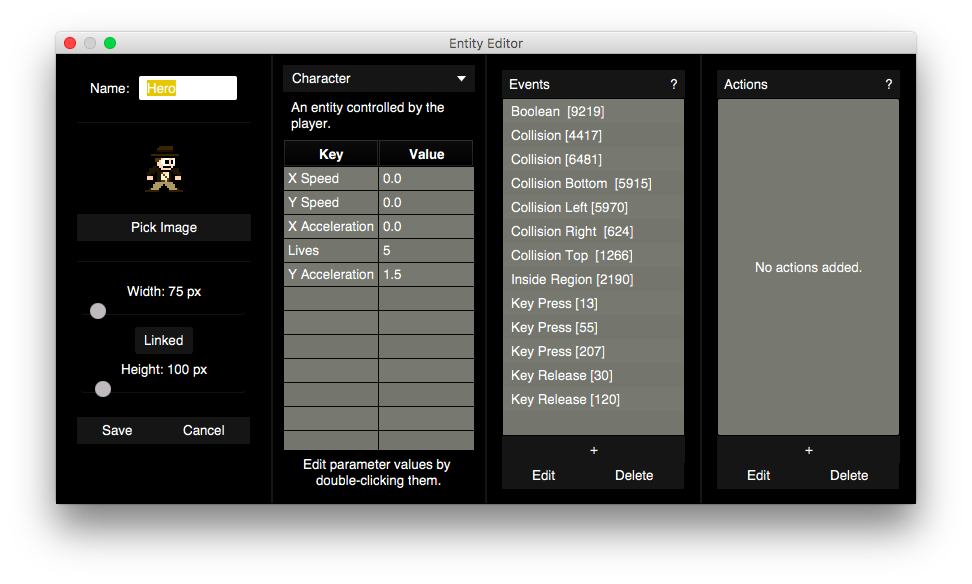
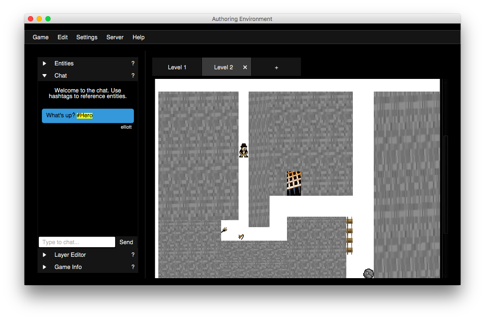
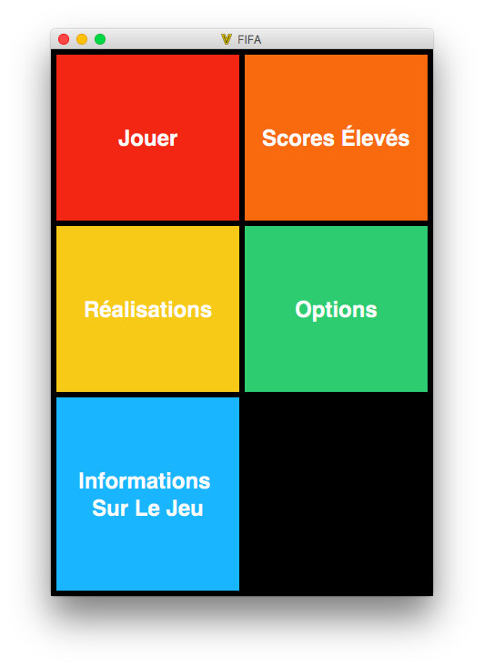
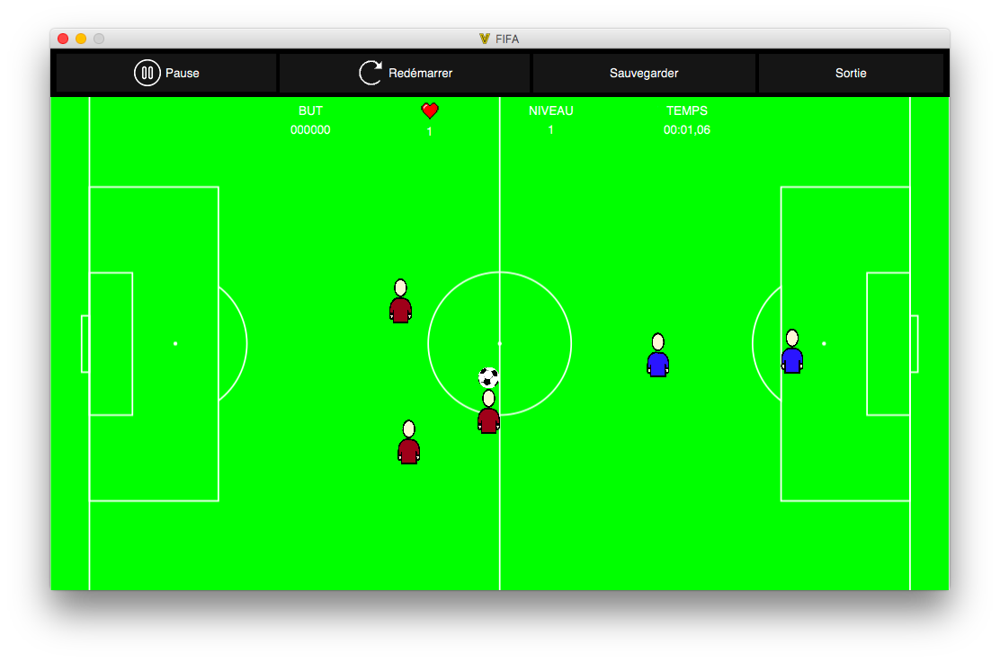

# VOOGASalad

A JavaFX team project (10-person group) for Duke's Computer Science 308 (Design and Implementation). For this final project, we built a game authoring engine and a game player (approximately 23,000 lines of code). 

This program is capable of creating, editing, and playing scrolling-platformer games such as Doodle Jump. It can also create many other games, like FIFA, checkers, etc. 

An example video showing 10 sample games made with VOOGASalad can be found [here](https://www.youtube.com/watch?v=wh1o5KRxGuo).

Extra features are incorporated, like:

- The ability to post images and status updates to Facebook on behalf of a user. I developed this feature myself, utilizing Facebook's graph API. It can be seen in the `FacebookPoster` repo.
- Networking ability. Live editing and chatting are available between different machines.
- Random level generation.

See below for more.

### Files Used to Start the Project (the class(es) containing main)

Our main class is located at: `src/starter/Main.java`.

### Any data or resource files required by the project (including format of non-standard files)

All data and resource files are contained in the folders `src/resources` (resources used by code), `data/resources` (resources that can be used to make games) and `src/polyglot/resources` (resources used by Polyglot).

### Any information about using the program (i.e., command-line/applet arguments, key inputs, interesting example data files, or easter eggs)

See extra features below for a comprehensive list of cool features.

### Any extra features included in the project

* Chat between two computers.
* Simultaneous editing of a game between two computers.
* Undo-redo button in the game-authoring environment
* Tutorials for making a game.
* Automatic translation of the project into hundreds of languages at runtime.
* The ability to post status updates to Facebook.
* Parse Boolean expressions for Events. Trigger complex combinations of Events using &&, ||, and !.
* The ability to generate levels in a game randomly
